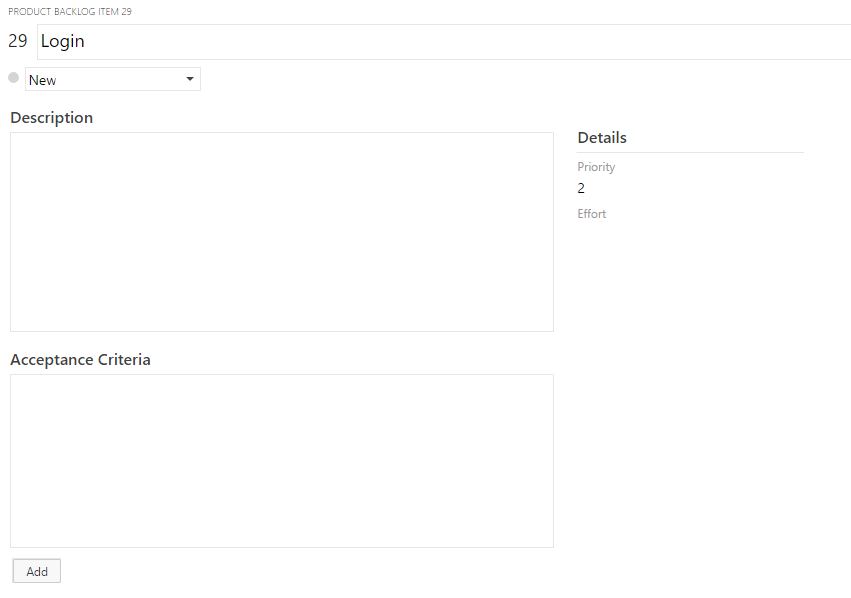
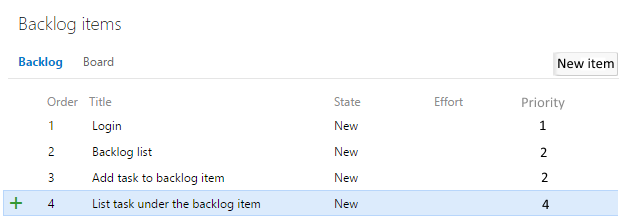
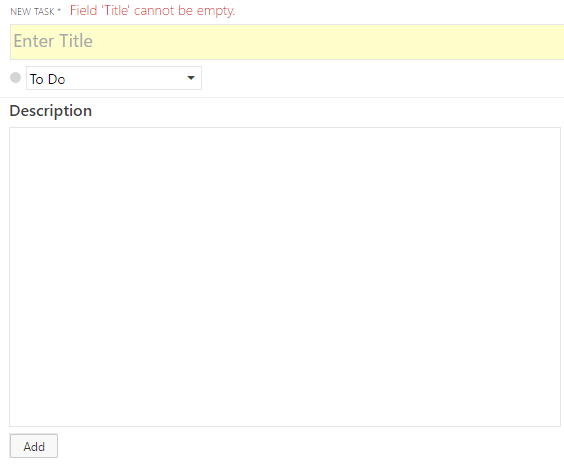
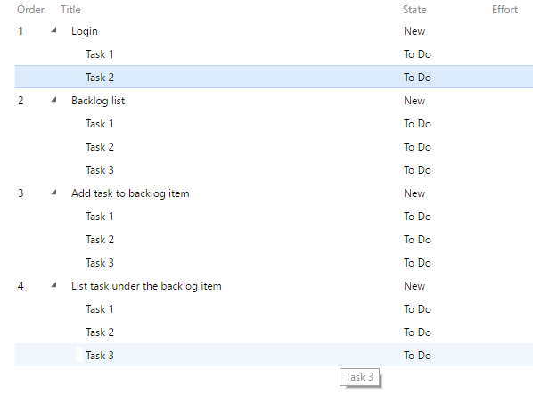
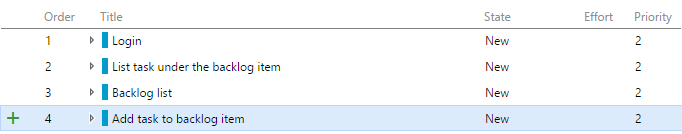
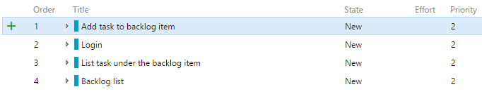

# Product Backlog

In the agile world is crutial to be able to track our work.
One tool for this is the product backlog
where the Product Owners can collect their ideas named backlog items.
After they added the items with description and acceptance criteria
the team can assign an effort to this item
and split them into concrete tasks.
Your work is to create a simple version of Product backlog.

## Features:

### Login

As a user I want to be able to login the system
so I can continue my previously started work.  
A user has a name and a password.  
After successful login
I see my user name in the upper right corner and I can log out.  
If the login was unsucessful
the system should warn the user in about Wrong name or password.  

*HINT: You can use cookie value
to store that the user is logged in or not.*  
*HINT2: You can store the user's data in the Local Storage (Web Storage)
or you can use IndexedDB*

### Add backlog item

As a user I want to be able to add new backlog items.
An item has the properties below:

* Id: automatically generated
* Title: Max 50 char
* Status (newly created items automatically set to New):
 * New
 * Approved
 * Committed
 * Done
* Description: Max 500 char
* Acceptance criteria: Max 500 char
* Priority: int value
* Effort: in value

*HINT: You can do it in a separated page.*

*Advanced solution: use modal window on the same page.*

### Backglog list

As a user I want to see my created backlog items in a list
with their basic properties ordered by the priority of them.

### Add task to backlog item

As a user I want to be able to add tasks to a concrete backlog item. A task has the properties below:

* Id: automatically generated
* BacklogItemId: id of the parent backlog item
* Title: max 50 char
* Description: Max 500 char
* Status:
 * To Do
 * In progress
 * Done

*HINT: You can do it in a separated page.*

*Advanced solution: use modal window on the same page.*

### List tasks under the backlog item

As a user I want to be able to list my added task under the backlog items.
The task list can be opened as a drop-down menu.

### Order backlog items

As a user I want to be able to order my backlog items
and rearrange them as many times as I want.
Each newly created backlog item
automatically added as last item on the backlog.
The order is saved so if I open the backlog next time
the items should be loaded in the same order I left it before.
All the backlog items are draggable so if I drag one of them
I can relocate it to another position in the list.
Other items order is automatically adjusted.
The order can be changed only in the backlog item list.
See the example below:

If I move the 4. element to the 1. position:

