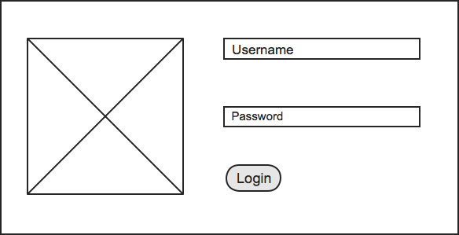

# Product Backlog

In the agile world is crutial to be able to track our work.
One tool for this is the product backlog
where the Product Owners can collect their ideas named backlog items.
After they added the items with description and acceptance criteria
the team can assign an effort to this item
and split them into concrete tasks.
Your work is to create a simple version of Product backlog.

## Features:

### Login

As a user I want to be able to login the system
so I can continue my previously started work.  
A user has a name and a password.  
After successful login
I see my user name in the upper right corner and I can log out.  
If the login was unsucessful
the system should warn the user in about Wrong name or password.  

*HINT: You can use cookie value
to store that the user is logged in or not.*  
*HINT2: You can store the user's data in the Local Storage (Web Storage)
or you can use IndexedDB*

### Add backlog item

As a user I want to be able to add new backlog items.
An item has the properties below:

* Id: automatically generated
* Title: Max 50 char
* Status (newly created items automatically set to New):
 * New
 * Approved
 * Committed
 * Done
* Description: Max 500 char
* Acceptance criteria: Max 500 char
* Priority: int value
* Effort: in value

*HINT: You can do it in a separated page.*
